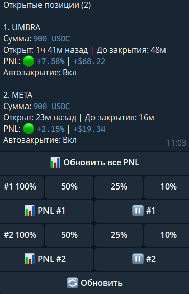

# Что такое DCA (Dollar Cost Averaging) ?

**DCA (Dollar Cost Averaging) (усреднение стоимости)** — стратегия инвестирования в токен на блокчейне Solana, при котором User (Пользователь) выполняет покупки данного токена в заданном ему интервале и на общую сумму, ниже вы можете посмотреть скриншот.

<figure><figcaption></figcaption></figure>

Данный User покупает данный токен "OOB" на общую сумму 100.000$, интервальное время ETA составляет 1 час и 40 минут, каждую минуту будет происходить покупка данного токена на сумму 1.000$

На скриншоте вы можете увидеть график движение цены с момента появление данного ордера.

<figure><figcaption></figcaption></figure>

На графике указаны значения точки входа, точки выхода (ботом вручную), прибыль и время завершение ордера.

Ордер был закрыт раньше запланированного времени на основании технического анализа и других факторов. Досрочное закрытие позволило зафиксировать более высокую прибыль по сравнению с тем результатом, который был бы достигнут при выполнении полного цикла по времени.

[Как выполняет свою функциональность и стратегию наш бот вы можете посмотреть в данном разделе](#user-content-fn-1)[^1]

[^1]: в
